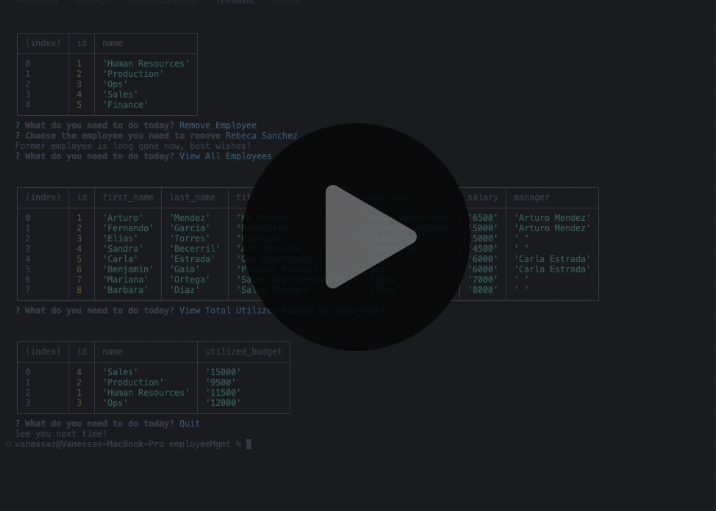

# EmployeeMgmt
The app is a business management tool designed for business owners to streamline the organization and planning of their company's internal structure. It offers intuitive interfaces and functionalities to view, manage, and update the company's departments, roles, and employees. This is a command-line application that manages a company's employee database, using Node.js, Inquirer, and PostgreSQL.

## User Story

AS A business owner 
I WANT to be able to view and manage the departments, roles, and employees in my company 
SO THAT I can organize and plan my business

## Acceptance Criteria

GIVEN a command-line application that accepts user input 
* WHEN I start the application 
THEN I am presented with the following options: view all departments, view all roles, view all employees, add a department, add a role, add an employee, and update an employee role
* WHEN I choose to view all departments 
THEN I am presented with a formatted table showing department names and department ids
* WHEN I choose to view all roles 
THEN I am presented with the job title, role id, the department that role belongs to, and the salary for that role
* WHEN I choose to view all employees 
THEN I am presented with a formatted table showing employee data, including employee ids, first names, last names, job titles, departments, salaries, and managers that the employees report to
* WHEN I choose to add a department
THEN I am prompted to enter the name of the department and that department is added to the database
* WHEN I choose to add a role 
THEN I am prompted to enter the name, salary, and department for the role and that role is added to the database
* WHEN I choose to add an employee 
THEN I am prompted to enter the employee’s first name, last name, role, and manager, and that employee is added to the database
* WHEN I choose to update an employee role 
THEN I am prompted to select an employee to update and their new role and this information is updated in the database
* When I choose to remove an employee 
THEN I am promted to select an employee to delete from database and when I chose one, it gets removed
* WHEN I choose to view department budgets 
THEN I am promted to select a department and it sums up the employees salary from the chosen department to get its budget.

## Go to my project
  
You can clone my repository [here](https://github.com/VanZittle/employeeMgmt).Please,do not forget to add your psql password into db.js file before test it!

## Visual reference of project
The following image demonstrates the app's appearance:
  

## License
  Go to license [here](https://github.com/VanZittle/employeeMgmt/blob/main/LICENSE)
  
Markdown generated with **[README Creator](https://github.com/VanZittle/module9-challenge-ReadmeGenerator)**
